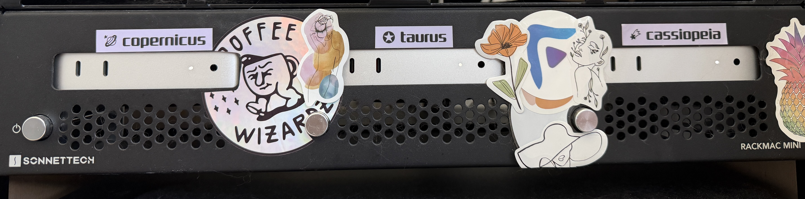

# Nomadintosh


An Ansible playbook for deploying [Nomad](https://developer.hashicorp.com/nomad/docs) + [Consul](https://developer.hashicorp.com/consul/docs) on a macOS cluster.

**[Nomad](https://developer.hashicorp.com/nomad/docs)** is a workload orchestrator by HashiCorp. It schedules and runs containerised and bare-metal applications across a cluster of machines, similar in spirit to Kubernetes but can run natively on macOS.

**[Consul](https://developer.hashicorp.com/consul/docs)** is a service mesh and service discovery tool, also by HashiCorp. It provides a distributed key-value store, health checking, and DNS-based service discovery. Nomad integrates with Consul natively to handle cluster membership and service registration.

<details>
<summary><strong>Why I built this</strong></summary>

I wanted a job orchestrator to keep my homelab workloads organised, but Kubernetes doesn't run natively on macOS or Apple Silicon — it requires a Linux VM intermediary, which adds overhead and complexity.

My previous homelab was a 3-node [Rancher Harvester](https://harvesterhci.io/) cluster. I wanted to experiment with Apple Silicon to evaluate performance-per-watt as an alternative, and Nomad was the natural fit: it runs as a native macOS binary, supports scheduling workloads directly on the host without a container runtime, and is significantly simpler to operate than Kubernetes at homelab scale.

A bonus of running bare-metal jobs is easy access to full hardware acceleration — no passthrough configuration needed.

Longer term, Nomad's multi-platform support means I can add Linux or Windows agents to the same cluster if needed — for example, running [Exact Audio Copy](https://www.exactaudiocopy.de/) on a Windows node for lossless CD ripping.


*"cosmonautical" — 2× M4 Mac Mini + 1× M4 Pro Mac Mini*


</details>

## Requirements

- Ansible installed on the control machine (`brew install ansible`)
- Ansible collections:
  ```
  ansible-galaxy collection install -r collections/requirements.yml
  ```

## Inventory

Hosts are organised into named groups; the group name becomes the Consul/Nomad [**datacenter**](https://developer.hashicorp.com/consul/docs/reference/agent/configuration-file/general#datacenter) for every host in that group. See [inventory/README.md](inventory/README.md) for full instructions on how to populate `inventory/hosts.yml`.

**Host variables:**

| Variable | Values | Purpose |
|---|---|---|
| `server` | `true` / _(absent)_ | Configures the host as a Nomad/Consul server |
| `container` | `true` / _(absent)_ | Installs Apple's [Container](https://github.com/apple/container) CLI and registers a LaunchAgent |
| `podman` | `true` / _(absent)_ | Installs and configures the Podman task driver |
| `docker` | `true` / _(absent)_ | Installs and configures Docker Desktop |
| `gh_actions` | `true` / _(absent)_ | Deploys a GitHub Actions runner Nomad job |
| `minecraft` | `true` / _(absent)_ | Deploys a Minecraft server Nomad job |
| `volumes` | list of `{name, path}` | Configures [Nomad host volumes](https://developer.hashicorp.com/nomad/docs/configuration/client#host_volume) on the client |

## Running the playbook

Run a full deployment:

```bash
./deploy.zsh
```

Dry-run in check + diff mode to preview changes without applying them:

```bash
./check.zsh
```

Serial Reboot all hosts in the inventory:

```bash
./reboot.zsh
```

To limit execution to a single host or group, you can also pass `--limit` directly to the underlying playbook:

```bash
ansible-playbook -i inventory/hosts.yml playbooks/nomadintosh.yml --limit <hostname>
```

## What it does

For every host, the playbook performs the following steps:

1. **Facts** — asserts the host is running macOS and sets the `datacenter` fact derived from the host's inventory group name.
2. **Software Update** — downloads all pending macOS system updates via `softwareupdate`, installs any available Command Line Tools for Xcode, and warns if a restart is required.
3. **Homebrew** — [Homebrew](https://brew.sh/) is the package manager of choice for this project. The playbook installs Homebrew if not present, taps `hashicorp/tap`, and installs any packages listed in `additional_homebrew_packages`. All system packages — including Consul, Nomad, Podman, and the Apple Container CLI — are managed exclusively through Homebrew.
4. **Apple Container** _(hosts with `container: true`)_ — installs Apple's [Container](https://github.com/apple/container) CLI via Homebrew and registers a LaunchAgent that starts the container system at login. On the Nomad side, the playbook downloads and installs [`nomad-driver-container`](https://github.com/anultravioletaurora/nomad-driver-container) — a custom Nomad task driver that integrates Nomad's scheduling with Apple's Container runtime. This allows Nomad jobs to run OCI containers natively on macOS using Apple's Virtualization.framework, without Docker Desktop or a Podman VM. The driver is configured in `nomad.d/server.hcl` with garbage collection enabled and log collection active.
5. **Docker Desktop** _(hosts with `docker: true`)_ — installs and configures Docker Desktop.
6. **Podman** _(hosts with `podman: true`)_ — installs Podman, initialises the machine, and installs the [`nomad-driver-podman`](https://developer.hashicorp.com/nomad/plugins/drivers/podman) plugin.
7. **Consul** — creates config/data directories, installs Consul via Homebrew, templates [`server.hcl`](https://developer.hashicorp.com/consul/docs/reference/agent/configuration-file) with datacenter, node name, server/client mode, and [`retry_join`](https://developer.hashicorp.com/consul/docs/reference/agent/configuration-file/general#retry_join) derived from inventory, and registers a LaunchAgent.
8. **Nomad** — creates config/data directories, installs Nomad via Homebrew, templates [`server.hcl`](https://developer.hashicorp.com/nomad/docs/configuration) (including [`bootstrap_expect`](https://developer.hashicorp.com/nomad/docs/configuration/server#bootstrap_expect) and [`retry_join`](https://developer.hashicorp.com/nomad/docs/configuration/server_join)), configures any enabled task driver plugins (`nomad-driver-container`, `nomad-driver-podman`), and registers a LaunchAgent.
9. **Nomad Jobs** — each optional job follows the same two-step process: the playbook renders a Jinja2 HCL template into a `.nomad.hcl` file under `{{ nomad_jobs_dir }}` (`/opt/nomad/jobs`), then submits it to the local Nomad agent via `nomad job run`. Jobs run as long-lived `service`-type allocations using the `raw_exec` driver, executing native binaries directly on the host. See [JOBS.md](JOBS.md) for a full reference of every supported job, including resource allocations, ports, and configuration variables.

Services are managed as macOS LaunchAgents (Nomad, Consul, and optionally the Podman machine and Apple Container system).

## Notifications

A reusable webhook task file is available at [`playbooks/tasks/notify.yml`](playbooks/tasks/notify.yml). Import it anywhere in a playbook to POST a notification on completion:

```yaml
- name: Send completion notification
  ansible.builtin.import_tasks: tasks/notify.yml
  vars:
    webhook_message: "nomadintosh deployment completed"
```

Store `notify_webhook_url` in Ansible Vault. The default body format is Discord-compatible (`content` + `username`); override with `webhook_body` for other platforms.

## Remarks

- **Platform** — This playbook is tested against Apple Silicon running macOS 26 Tahoe. Mileage on x86 Macs or other macOS versions may vary.
- **Bare-metal preference** — Where possible, workloads are deployed as native bare-metal jobs rather than containers. This is a deliberate choice to optimise performance on macOS — specifically to avoid the memory overhead of the Linux VM that Docker Desktop and Podman require on macOS, and to take advantage of native hardware acceleration (Metal, VideoToolbox, Core ML) which is unavailable or requires passthrough configuration inside a container runtime.
- **`nomad-driver-container` is experimental** — The [nomad-driver-container](https://github.com/anultravioletaurora/nomad-driver-container) plugin is an early-stage, lightly tested project. It may behave unexpectedly, and is not recommended for workloads where stability is critical.

## Special Thanks

- **[Jeff Geerling](https://www.jeffgeerling.com/)** — for his extensive work on [Ansible for DevOps](https://www.ansiblefordevops.com/), his [open-source Ansible roles](https://github.com/geerlingguy), and his deep-dive coverage of [Apple Silicon in homelabs](https://www.youtube.com/@JeffGeerling) that helped inspire this project.
- **[HashiCorp](https://www.hashicorp.com/)** — for building [Nomad](https://developer.hashicorp.com/nomad/docs) and [Consul](https://developer.hashicorp.com/consul/docs), making native macOS workload orchestration possible.
- **[Homebrew contributors](https://github.com/Homebrew/brew/graphs/contributors)** — for maintaining the package manager that makes the entire software stack on this project possible. Every binary this playbook installs — from Nomad and Consul to Podman and the Apple Container CLI — is delivered and kept up to date through Homebrew.
- **[nomad-driver-podman contributors](https://github.com/hashicorp/nomad-driver-podman)** — for the Podman task driver plugin that enables rootless container workloads on Nomad.
